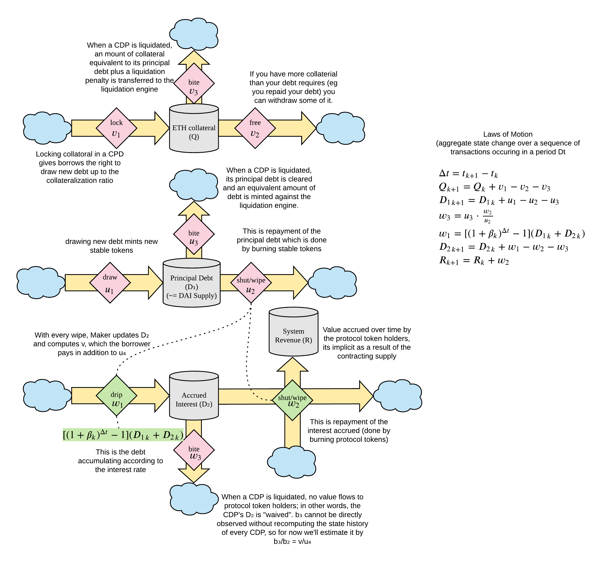

<!-- #region -->
# Glossary

**General terms**
* APT - [Arbitrage Pricing Theory (APT)](https://www.investopedia.com/terms/a/apt.asp) is a factor pricing model that uses an arbitrage argument to define the impact of factors on the generating process of an asset's return.
* CDP
* Redemption Price
* Market Price
* Redemption Rate
* Proportional-Integral-Derivative (PID) controller - is the most commonly implemented real-world stability controller type in the world, and both its modelingstructure and its parameter tuning are well-researched problems.

## PID Controller
* Set point -   The set point $$p_s(t)$$ of the controller is the redemption price $$p_r(t)$, in units of $\frac{USD}{RAI}$:
$$
p_s(t) \equiv p_r(t) \: \forall t
$$

# System Model v2.0

## CDP system

**Aggregate**
* `eth_collateral` -- "Q"; total ETH collateral in the CDP system i.e. locked - freed - bitten
* `principal_debt` -- "D_1"; the total debt in the CDP system i.e. drawn - wiped - bitten
* `accrued_interest` -- "D_2"; the total interest accrued in the system i.e. current D_2 + w_1 - w_2 - w_3

**CDP ETH collateral**
* `v_1` -- discrete "lock" event, in ETH; locking collateral in a CDP gives borrowers the right to draw new debt up to the collateralization ratio
* `v_2` -- discrete "free" event, in ETH; if you have more collateral than your debt requires, you can withdraw some of it
* `v_3` -- discrete "bite" event, in ETH; when a CDP is liquidated, an amount of collateral equivalent to its principal debt plus a liquidation penalty is transferred to the liquidation engine

**CDP principal debt**
* `u_1` -- discrete "draw" event, in RAI; drawing new debt mints new stable tokens
* `u_2` -- discrete "wipe" event, in RAI; repayment of the principal debt by burning stable tokens
* `u_3` -- discrete "bite" event, in RAI; when a CDP is liquidated, its principal debt is cleared and an equivalent amount of debt is minted against the liquidation engine

**Accrued interest**
* `w_1` -- discrete "drip" event, in RAI
* `w_2` -- discrete "shut"/"wipe" event, in RAI
* `w_3` -- discrete "bite" event, in RAI

## APT system

TODO: update APT glossary
<!-- #endregion -->
