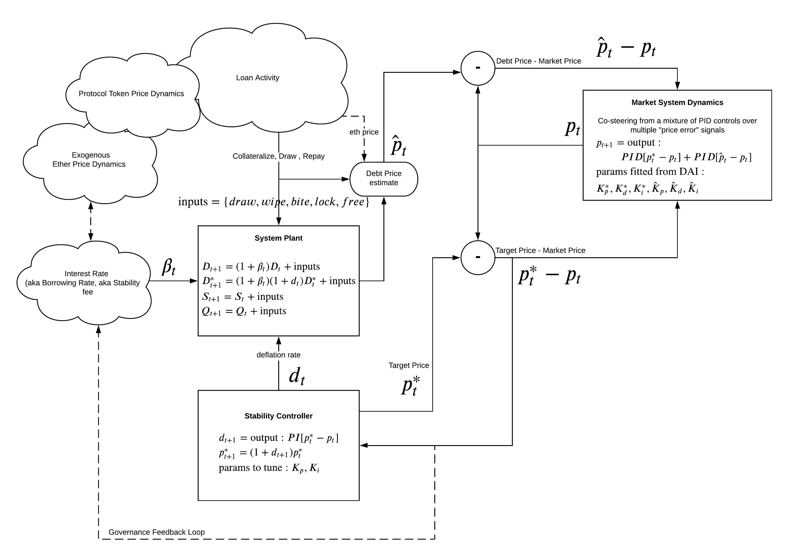
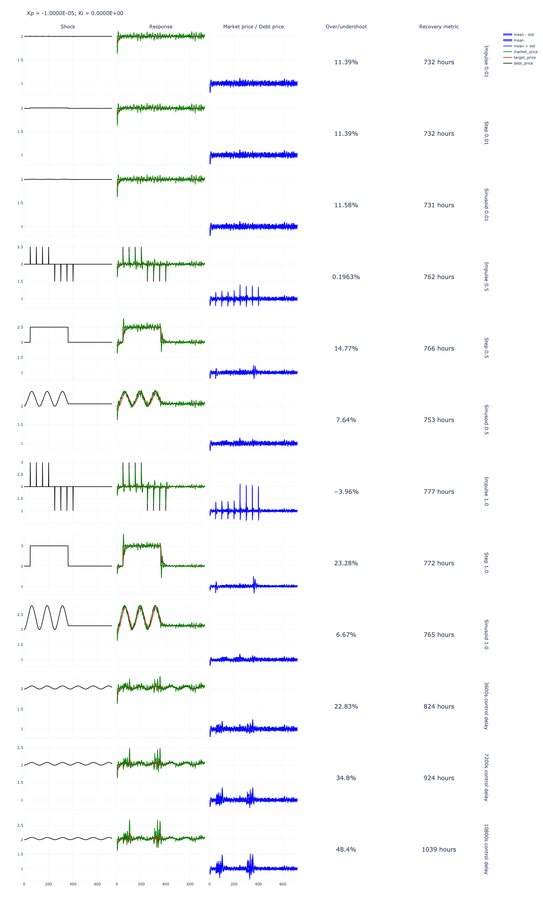

# Reflexer, RAI




## Table of Contents

Each model is located under `models/_`, with a unique name for each experiment.

* `models/run.py` - script to run simulation experiments
* `models/_/model` - model configuration (e.g. PSUBs, state variables)
* `models/_/model/parts` - model logic, state update functions, and policy functions

Directories:

* `diagrams/` - system diagrams, used in documentation
* `exports/` - exports from simulations, such as datasets, charts, etc.
* `lib/` - third party libraries modified for use within models and simulations, such as Scipy which had to be patched
* `logs/` - output directory for cadCAD model logs (local only, in `.gitignore`)
* `models/` - system and subsystem models, as well as ML/regression model development
* `notebooks/` - lab notebooks for model simulation and visualization using cadCAD (some notebooks have synced `.py` templates, see "Jupyter Notebook" below)
* `plots/` - static plots used in notebooks
* `simulations/` - execution of simulation notebooks using Papermill
* `tests/` - `pytest` tests and misc. testing resources
* `utils/` - utility code used within notebooks, for example generating plots

Files:

* `shared.py` - file containing shared notebook imports and setup

# Models

## System Model v1.0: Debt Price Regression and Fitted Market Model

Full system model with parameters for selecting & stress testing subsystems, such as the controller, the debt price regression model, and the fitted market model.

* Model code: `models/system_model_v1/`
* Notebooks: `notebooks/system_model_v1/`

### Notebooks

1. [Market Price Driven Model: PI Controller Tuning](notebooks/system_model_v1/notebook_validation_market_price.ipynb)
    * The purpose of this experiment is to tune and test the PI controller, by driving the market price directly.
1. [Debt Price Driven Model: PI Controller Tuning](notebooks/system_model_v1/notebook_validation_debt_price.ipynb)
    * The purpose of this experiment is to tune and test the PI controller, by driving the debt price directly.
2. [Debt Price Model & Market Model Validation](notebooks/system_model_v1/notebook_validation_regression.ipynb)
    * The purpose of this experiment, is to validate the system model, using a debt market regression model trained using historical data.

## System Model v2.0: CDP, APT, Secondary Market Subsystems

Full system model with CDP, APT, and secondary market subsystems.

* Model code: `models/system_model_v2/`
* Notebooks: `notebooks/system_model_v2/`

### Notebooks

1. [Full system model](notebooks/system_model_v2/notebook_debt_market.ipynb)

## Solidity / cadCAD "Cross Model"

* Model code: `cross-model/`

## Market Model

* Model code: `models/market_model/`

## APT Model

* Model code: `models/apt_model/`

---

# Dependencies

## Large File Dependencies

The following pickle files in `models/pickles/` should be obtained and copied or linked into the repo. They are ignored in the `.gitignore` file to avoid hitting file size and bandwidth limits:

* `apt_debt_model_2020-11-28.pickle`

## System Dependencies

* `swig` for `auto-sklearn` Python library. Use `brew install swig@3` or:

```
apt-get remove swig
apt-get install swig3.0
rm -rf /usr/bin/swig3.0 /usr/bin/swig
ln -s /usr/bin/swig3.0 /usr/bin/swig
```

* `truffle` for running the Solidity simulations:

```
npm install -g truffle
```

## Python Dependencies

You'll need Python 3+ and NodeJS/NPM (v10.13.0) in your environment.

```bash
python3 -m venv venv
source venv/bin/activate
pip3 install wheel
pip3 install -r requirements.txt
jupyter labextension install jupyterlab-plotly@4.9.0 # --minimize=False
python -m ipykernel install --user --name python-reflexer --display-name "Python (Reflexer)"
jupyter-lab
```

# Jupyter Notebook

To start Jupyter Notebook, with all dependencies available:
```bash
source venv/bin/activate
jupyter-lab
```

## Jupytext Paired Notebooks

Jupytext allows us to create a notebook paired with a Python script, to more easily keep track of updates, and execute simulation notebooks. In the `notebooks/` directory, check if their is both an `.ipynb` and `.py` file for a notebook, then use the following command to sync the two files when necessary:

```
# Initialize paired ipynb/py notebook: `jupytext --set-formats ipynb,py:percent notebooks/notebook.ipynb`
jupytext --sync --update notebooks/notebook.ipynb
```

# Modelling & Simulation

## cadCAD Model Simulation

To run simulation:
```python
python3 models/run.py
```
or
```python
from models.run import run
from models.config_wrapper import ConfigWrapper
import models.system_model_v1 as system_model_v1

simulation = ConfigWrapper(system_model_v1)
simulation.append()

result = run(drop_midsteps=True)
```

## Solidity / cadCAD Cross-Model Simulation

```bash
cd ./cross-model/truffle
npm install
npm setup-network
# Open and run notebooks/solidity_cadcad/notebook_solidity_validation.ipynb
```

# Tests

## Unit Tests

`python -m pytest ./tests`

## System Shock Tests

See `tests/run_shock_tests.py` for the set of Ki and Kp parameter sweeps.

```bash
python tests/run_shock_tests.py
```

Outputs:
* `exports/_.png` - metric grid for each set of parameters
* `notebooks/system_model_v1/shock_tests.ipynb` - template notebook for running test and generating grid

## Simulation Profiling

```python
python3 -m cProfile -s time models/run.py
```
