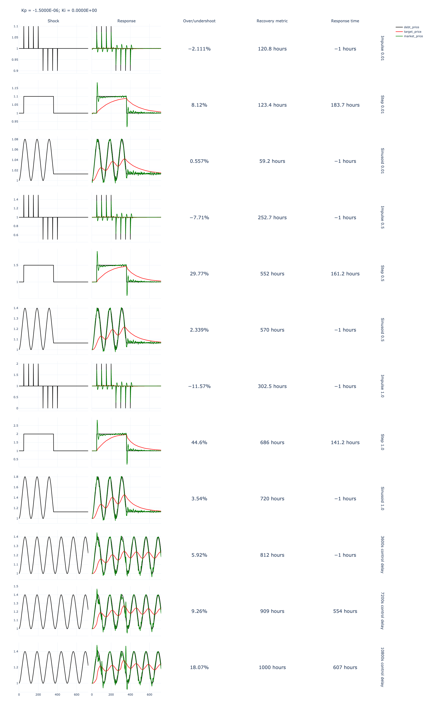
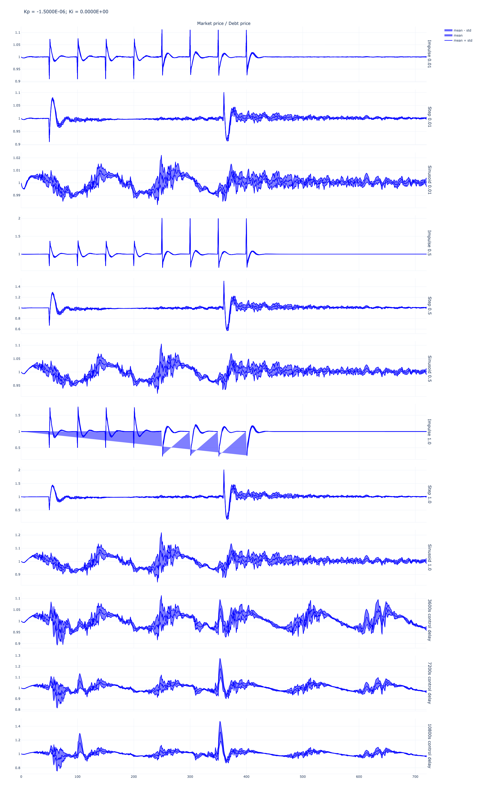
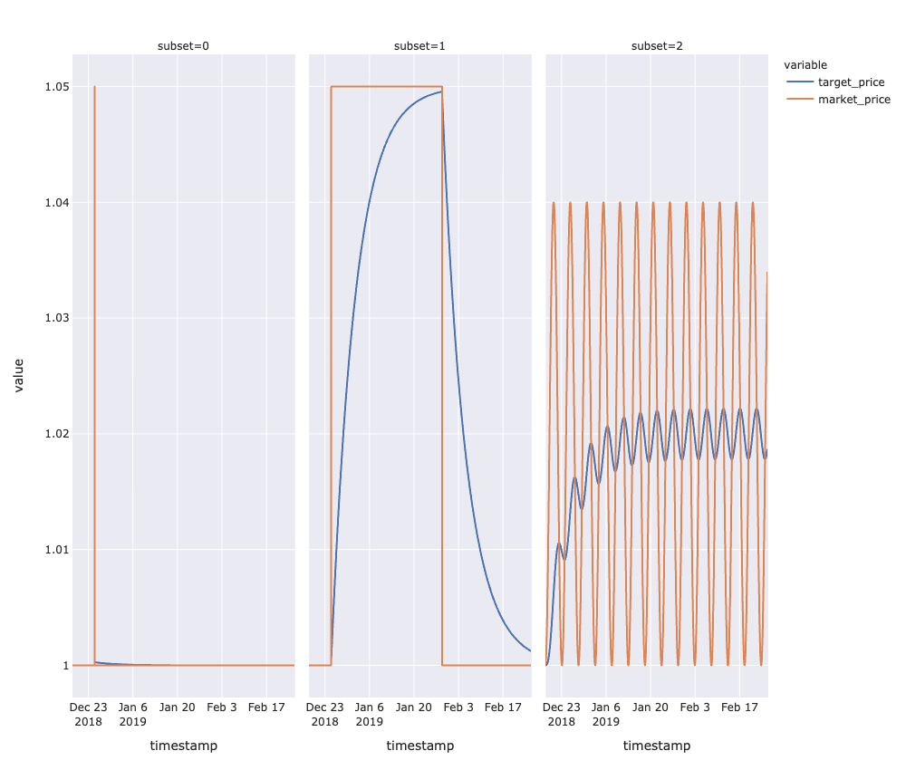
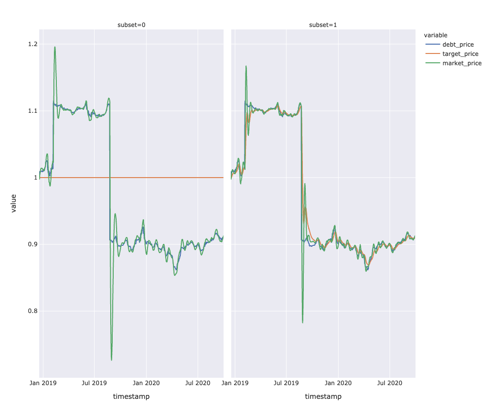
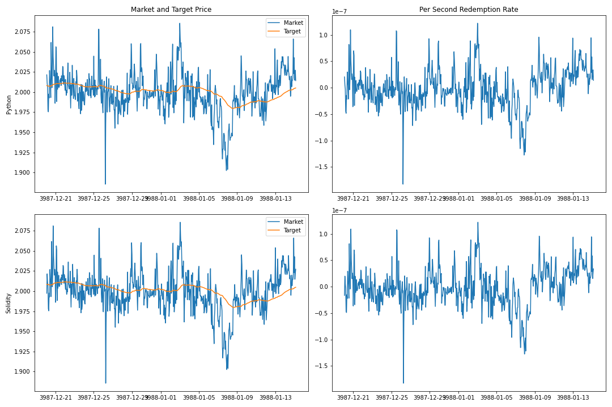
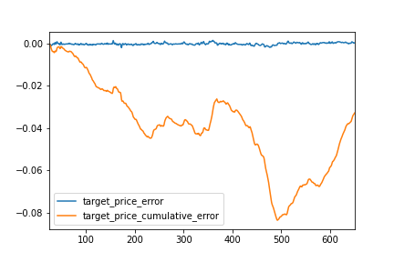

# Parameter Choice Recommendations

* Ideal Kp parameter value for launch: `-1.5e-6`
* Range of Kp parameters given KPI metrics (response time, stability, sensitivity, error): `-3e-06, -2e-06, -1e-06, -9e-07, -8e-07, -7e-07`

## Relevant Analysis and Resources

See `exports/shock_datasets` for raw Pandas dataframes.

See `exports/shock_analysis/v1`:
* Paramater choice analysis: `shock_analysis.ipynb`
* Shock metrics: for range of Kp parameters that meet KPIs
* Shock standard deviations: for range of Kp parameters that meet KPIs

See `notebook_solidity_validation.ipynb` for Solidity/cadCAD validation and error stats.

## Outputs for Kp `-1.5e-6`

### Shock Metrics

### Shock Standard Deviation

### Market Shock Response

### Regression Model Response

### Solidity cadCAD Validation

